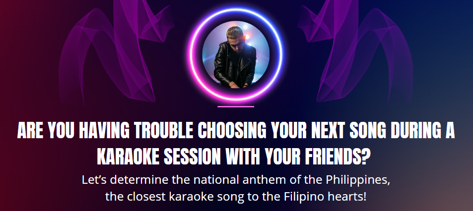

<h1 style="color:#000000">I. Executive Summary</h1>

The art of vocal mimicry is a national pastime in the philippines.

It is an understatement to say that Filipinos love karaoke. Almost every Philippine home has a karaoke machine or a Magic Sing microphone – a digital mic that turns your television into a karaoke machine. It’s almost always a feature at birthday and holiday parties. And scores of bars and restaurants offer karaoke or videoke (a more competitive version that scores singers and records their performances).

This project aims to build a recommender engine that determines the top five song titles based on word query. The word query is the "tip of tongue" word that you use to describe the song as it is a usual occurence during karaoke sessions that you probably know the song, even the entirity of its lyrics, but you just can't seem to remember its title. 

<h1 style="color:#000000">II. Problem Statement</h1>

<h1 style="color:#000000">III. Motivation</h1>

Tip of the tongue (also known as TOT or lethologica) is the phenomenon of failing to retrieve a word or term from memory, combined with partial recall and the feeling that retrieval is imminent.[1] The phenomenon's name comes from the saying, "It's on the tip of my tongue."[2][3][4]

This project aims to build a recommender engine that determines the top five song titles based on word query. It is a usual occurence during karaoke sessions that you probably know the song, even the entirity of its lyrics, but you just can't seem to remember its title. 

<h1 style="color:#000000">VIII. Results and Discussion</h1>

<b>Why we use cosine similarity instead of $L_p$-norm?</b>
&nbsp; 
 

**$L_p$-norm** is basically the distance between two vectors or points. The $L_p$-norm between two vectors $\vec v_1$ and $\vec v_2$ is
$$L_p(\vec v_1, \vec v_2) = \left(\sum_i \left| \vec v_{1_i} - \vec v_{2_i} \right|^p \right)^{1/p}$$

If $p=2$, it is the usual Euclidean distance. If $p=1$, it is known as the city block or Manhattan distance.

On the other hand, the **cosine similarity** between two vectors is related to the angle between them. The cosine similarity between two vectors $\vec v_1$ and $\vec v_2$ is
$$S_\text{cos}(\vec v_1, \vec v_2) = \frac{\vec v_1 \cdot \vec v_2}{\left|\left|\vec v_1\right|\right| \left|\left| \vec v_2 \right|\right|}.$$

If the vectors are nonnegative, which is the case for BoW vectors, its range is $[0,1]$ with 1 implying the two vectors are aligned (most similar) and 0 implying they are perpendicular (least similar).

The cosine similarity is beneficial because even if the two similar data objects are far apart by the Euclidean distance because of the size, they could still have a smaller angle between them. Smaller the angle, higher the similarity.

For recommender systems, one of the most commonly used similarity measures is cosine similarity.

<b>Which is better? Count Vectorizer or TF-IDF Vectorizer?</b>

TF-IDF is in general better than Count Vectorizers because it not only focuses on the frequency of words present in the corpus but also provides the importance of the words. We can then remove the words that are less important for analysis, hence making the model building less complex by reducing the input dimensions.
    
<b>Does our Filipino stopwords include all Filipino words??</b>

No. One of the limitations of this project is the limited availability of Filipino stop words. The filipino stop words module that the project used only contains less than 150 Filipino stop words.
    
<h1 style="color:#000000">IX. Conclusion</h1>

The project was able to answer the problem statement by utilizing a combination of TF-IDF Vectorization, PCA Dimensionality Reduction, and K Means Clustering methodologies. 

We were able to identify a strong correlation between the feature `love` and the principal components. In fact, by using the unsupervised models of k means clustering, we were still able to match songs which are closely related to `love`.

However, working with a lot a constraints such as the Filipino stop words limitations, unavailability of a genre specification, lack of sentiment analysis, we were not able to fully grasp the semantics of the features.

<h1 style="color:#000000">X. Recommendation</h1>

One way to improve the project is by having a target feature such as genre so that we gauge the accuracy of our information retrieval methodogy as well as create other exploratory tools such as confusion matrix.

To take the project to a whole new level, we can match the userID of the comments to their respective geolocations, so we can identify the all time favorite songs of each region of the country.

<h1 style="color:#000000">XI. References</h1>

[1] Schwartz, BL. (Sep 1999). <a id="ref2" href="https://link.springer.com/article/10.3758/BF03210827.">"Sparkling at the end of the tongue: the etiology of tip-of-the-tongue phenomenology". </a> Psychonomic Bulletin & Review. 6 (3): 379–93. doi:10.3758/bf03210827. PMID 12198776.
 
[2] Brown, Roger; McNeill, David (1966). <a id="ref2" href="https://www.sciencedirect.com/science/article/abs/pii/S0022537166800403?via%3Dihub.">"The "tip of the tongue" phenomenon". </a> Journal of Verbal Learning and Verbal Behavior. 5 (4): 325–337. doi:10.1016/S0022-5371(66)80040-3.
 
[3] Rastle, Kathleen G.; Burke, Deborah M. (1996). <a id="ref2" href="https://www.sciencedirect.com/science/article/abs/pii/S0749596X96900315?via%3Dihub.">"Priming the Tip of the Tongue: Effects of Prior Processing on Word Retrieval in Young and Older Adults". </a> Journal of Memory and Language. 35 (4): 586–605. doi:10.1006/jmla.1996.0031. S2CID 13884102.

[4] Oliver Picken. (2022, Feb 20). <a id="ref2" href="https://www.theedgesusu.co.uk/records/2022/02/20/why-are-pop-songs-so-obsessed-with-love/."> Why Are Pop Songs So Obsessed With Love?</a> The Edge: The University of Southampton's entertainment magazine.

[5] Breitinger, Corinna; Gipp, Bela; Langer, Stefan (2015-07-26). <a id="ref2" href="https://link.springer.com/article/10.1007/s00799-015-0156-0.">"Research-paper recommender systems : a literature survey"</a> <i>International Journal on Digital Libraries. 17 (4): 305–338.</i> doi:10.1007/s00799-015-0156-0. ISSN 1432-5012 S2CID 207035184

